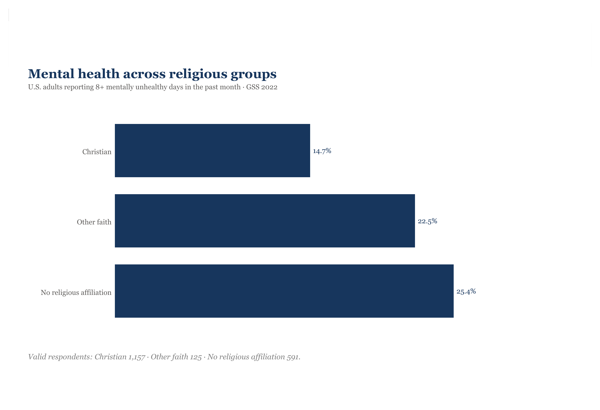
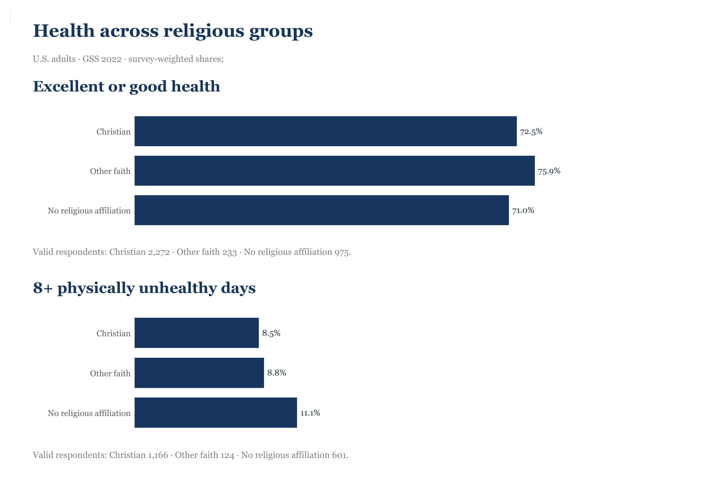

# Christian Wellbeing: Faith and Health Data Story

An evidence-first portfolio project about self-reported health and religious
affiliation among U.S. adults in the 2022 General Social Survey.



> **Core principle:** these results describe associations.

## View the live interactive Power BI report

**[Open the public Power BI report](https://app.powerbi.com/view?r=eyJrIjoiMWNmYzlkY2UtOGZjOS00ZTFiLWJmY2UtOTIxYTkwMDM5MGFiIiwidCI6ImEwNzg4YjhlLWYwNDktNGY1YS04OGEyLTY3NTliZWY2OWM3NiIsImMiOjl9&pageName=MentalHealthEditorial)**

No Power BI sign-in is required. The two-page report is optimized for desktop
and phone viewing, opens on **01 | Mental Health**, and contains only reviewed
aggregate values.

### Embed this report

GitHub does not render iframe elements in README files, but the report can be
embedded in an HTML page with this exact snippet:

```html
<iframe title="ChristianWellbeing2022" width="600" height="373.5" src="https://app.powerbi.com/view?r=eyJrIjoiMWNmYzlkY2UtOGZjOS00ZTFiLWJmY2UtOTIxYTkwMDM5MGFiIiwidCI6ImEwNzg4YjhlLWYwNDktNGY1YS04OGEyLTY3NTliZWY2OWM3NiIsImMiOjl9&pageName=MentalHealthEditorial" frameborder="0" allowFullScreen="true"></iframe>
```

## The question

How do general, physical, and mental self-reported health differ among adults
who identify as Christian, with another faith, or with no religious affiliation?

## Results

| Metric | Christian | Other faith | No religious affiliation |
|---|---:|---:|---:|
| Excellent or good general health | 72.45% | 75.85% | 70.96% |
| 8+ physically unhealthy days | 8.48% | 8.83% | 11.10% |
| 8+ mentally unhealthy days | 14.65% | 22.52% | 25.42% |

The Other faith group is comparatively small, so its confidence intervals are
wider. The mental-health differences are descriptive and may reflect age,
income, education, community support, access to care, or other confounders.

## Power BI report

The editable source is a text-based Power BI Project at
[`powerbi/project/ChristianWellbeing2022/ChristianWellbeing2022.pbip`](powerbi/project/ChristianWellbeing2022/ChristianWellbeing2022.pbip).
It contains two desktop pages and corresponding portrait phone layouts.

### 01 | Mental Health

The landing page focuses on adults reporting eight or more mentally unhealthy
days in the past month.


### 02 | Health Context

The second page provides aligned comparisons of excellent or good general
health and eight or more physically unhealthy days.



The three native horizontal bar charts use direct values, zero baselines, and
restrained editorial styling. Survey-design-adjusted 95% confidence intervals
and valid respondent counts are available in interactive tooltips; static
screenshots do not show those intervals. The PBIP embeds only the nine reviewed
aggregate rows and is checked against `data/processed/chart_data.csv`.

The phone layouts preserve the same reading order in a narrow, full-width
story: the main comparison first, followed by its respondent context. The
Health Context page stacks its two comparisons vertically rather than placing
them side by side.

## Technologies and workflow

The project combines NORC GSS 2022 survey data with a reproducible Python
analysis pipeline, an aggregate-only Power BI semantic model, and a
Git-reviewable PBIP report. Power BI Desktop and Power BI Service provide the
desktop, phone, and public interactive experiences. OpenAI Codex assisted with
implementation, UI operation, testing, documentation, and QA under human
review, while GitHub and Notion preserve the technical and decision history.

| Technology | How it was used |
|---|---|
| NORC General Social Survey 2022 | Source dataset and survey-design fields. Respondent-level records are excluded from GitHub and Power BI. |
| Python | Reproducible downloading, SHA-256 verification, data preparation, analysis, rendering, and release checks. |
| pandas and NumPy | Data transformations, survey-weighted estimates, Taylor-linearized confidence intervals, and aggregate outputs. |
| Python standard library | `urllib`, `zipfile`, `hashlib`, `csv`, `json`, and file-processing utilities used by the reproducible pipeline. |
| Python `unittest` | Regression checks for mappings, estimates, embedded values, Power BI bindings, mobile definitions, and repository safety. |
| Pillow | Reproducible static analytical PNG and PDF exports from reviewed aggregate values. |
| Power BI Desktop | Desktop and portrait-phone report authoring, local rendering, export, and publication. |
| Power Query M | The embedded aggregate-only `ChartData` table. |
| DAX | Estimate, confidence-bound, respondent-count, and source-label measures. |
| PBIP, PBIR, and TMDL | Text-based, Git-reviewable report and semantic-model definitions. |
| Power BI Service and Publish to web | Hosted interactive report and anonymous public delivery. |
| Git and GitHub | Version control, branch review, pull requests, merge history, and public portfolio documentation. |
| GitHub CLI | Authenticated pull-request creation, metadata updates, checks, and merge verification. |
| OpenAI Codex | AI-assisted implementation and QA under human review; not a runtime dependency or source of statistical results. |
| Notion | Persistent project log for decisions, progress, QA, publication evidence, and release status. |

## Notion project log

A private Notion log accompanies the public repository. It records design
decisions, analytical caveats, implementation progress, test evidence, Power BI
publication checks, and the final release status. Notion is documentation only:
it is not a data source, calculation engine, or runtime dependency. The log is
kept private because it also contains working notes and review checkpoints that
are not part of the published portfolio artifact.

## Codex plugins and skills used

These tools supported authoring and verification. They are not runtime
dependencies and did not generate the statistical results.

| Plugin or skill | Role in the project |
|---|---|
| Power BI Desktop plugin | PBIP inspection, semantic-model review, mobile-layout work, and release checks. |
| Power BI browser plugin | Verification of the Power BI Service report and anonymous public viewer. |
| Computer Use plugin | Operation of Power BI Desktop and responsive browser checks. |
| Data Analytics — Visualize Data | Human-centered chart and mobile-layout review for clarity, context, uncertainty, and accessibility. |
| Data Analytics — Validate Data | Reconciliation of calculations, measures, visuals, claims, and release readiness. |
| PDF skill | Rendering and visual inspection of the exported two-page Power BI PDF. |
| Notion Knowledge Capture | Structured updates to the project decision and release log. |
| Codex GitHub task tools and GitHub CLI | Pull-request attachment, state checks, and merge verification. |

## Reproduce the analysis

```powershell
python scripts/download_data.py
python scripts/analyze.py
python scripts/render_chart.py
python -m unittest discover -s tests -v
```

The download is pinned by SHA-256. Raw respondent data is stored under
`data/raw/` and excluded from Git. The Power BI model uses only the nine-row
aggregate file in `data/processed/chart_data.csv`.

## Repository guide

- `scripts/`: verified download and survey-weighted analysis pipeline
- `tests/`: analytical, Power BI, mobile-layout, and repository-safety checks
- `data/processed/`: aggregate Power BI input and data-quality receipt
- `docs/`: methodology and public data dictionary
- `powerbi/`: editable PBIP source, theme, visual specification, and verified exports
- `linkedin/`: English LinkedIn draft

## Method summary

Estimates use `WTSSNRPS`. Confidence intervals use Taylor linearization with
`VSTRAT` and `VPSU`. Metric-specific reserved and missing responses are
excluded. See [`docs/methodology.md`](docs/methodology.md) for definitions,
group mappings, design details, and limitations.

## Data source and license

Source: [General Social Survey 2022](https://gss.norc.org/get-the-data.html),
NORC at the University of Chicago.

The original analysis code, Power BI configuration, and project documentation
in this repository are released under the [MIT License](LICENSE). Respondent-
level GSS data is not included and is not licensed under MIT. GSS source data
remains subject to the NORC/GSS documentation and terms; users must obtain it
from the official GSS source. This repository does not relicense GSS source
records.
