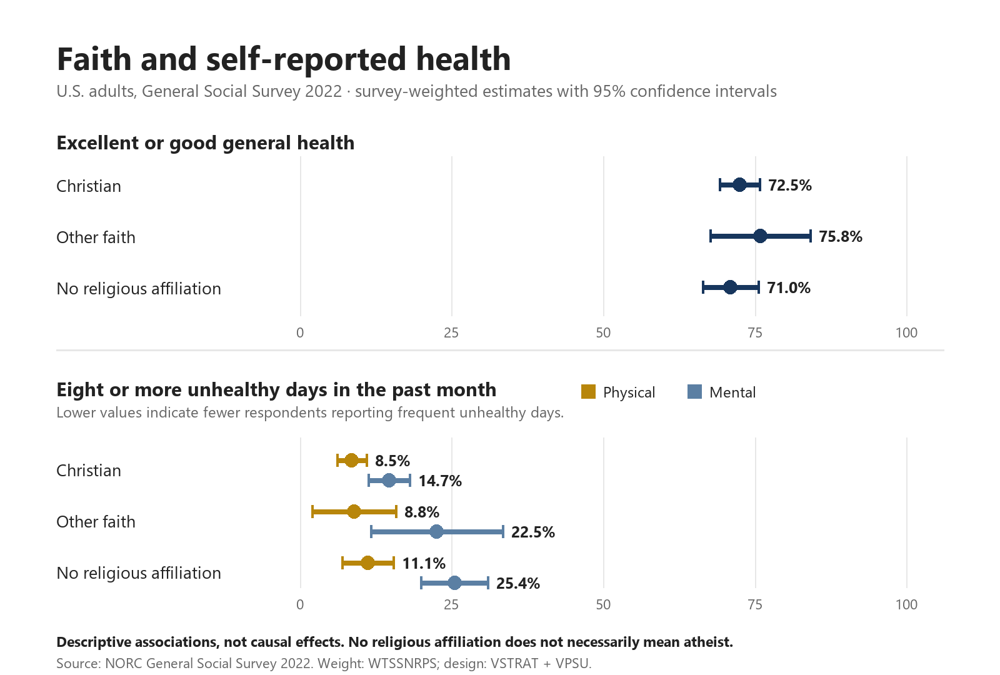

# Christian Wellbeing: Faith and Health Data Story

An evidence-first portfolio project about self-reported health and religious
affiliation among U.S. adults in the 2022 General Social Survey.



> **Core principle:** these results describe associations. They do not show
> that religious faith causes better or worse health.

## The question

How do general, physical, and mental self-reported health differ among adults
who identify as Christian, with another faith, or with no religious affiliation?

## Results

| Metric | Christian | Other faith | No religious affiliation |
|---|---:|---:|---:|
| Excellent or good general health | 72.45% | 75.85% | 70.96% |
| 8+ physically unhealthy days | 8.48% | 8.83% | 11.10% |
| 8+ mentally unhealthy days | 14.65% | 22.52% | 25.42% |

The Other faith group is comparatively small, so its confidence intervals are
wider. The mental-health differences are descriptive and may reflect age,
income, education, community support, access to care, or other confounders.

## Power BI report

The [interactive Power BI report](https://app.powerbi.com/view?r=eyJrIjoiYzczNGI3ZTctYjY1NS00MmRiLWFhMDYtOTA3MjBjMDhhMTQ2IiwidCI6ImEwNzg4YjhlLWYwNDktNGY1YS04OGEyLTY3NTliZWY2OWM3NiIsImMiOjl9)
uses an aggregate-only semantic model and loads without authentication. Report
design and field configuration are documented in
[`powerbi/visual_spec.md`](powerbi/visual_spec.md).

The editable portfolio source is a text-based Power BI Project at
[`powerbi/project/ChristianWellbeing2022/ChristianWellbeing2022.pbip`](powerbi/project/ChristianWellbeing2022/ChristianWellbeing2022.pbip).
It contains two 1600 × 1080 pages:

1. **Mental Health** — the landing page, focused on adults reporting eight or
   more mentally unhealthy days in the past month.
2. **Full Health Overview** — general health above aligned physical- and
   mental-health comparisons.

All four charts display absolute, field-driven 95% confidence intervals. The
PBIP embeds only the nine reviewed aggregate rows and is automatically checked
against `data/processed/chart_data.csv`. The existing public report has not
been replaced; this redesign remains a local-review release candidate.

The final Desktop PDF and two page screenshots are pending visual QA. They will
be added to this review branch before the PR is marked ready. The earlier
Python-rendered portfolio figure remains available below.

Portfolio exports: [PNG](powerbi/exports/christian_wellbeing_report.png) ·
[PDF](powerbi/exports/christian_wellbeing_report.pdf). They are generated from
the same nine-row aggregate dataset and show the design-adjusted 95% confidence
intervals directly.

## Reproduce the analysis

```powershell
python scripts/download_data.py
python scripts/analyze.py
python scripts/render_chart.py
python -m unittest discover -s tests -v
```

The download is pinned by SHA-256. Raw respondent data is stored under
`data/raw/` and excluded from Git. The Power BI model uses only the nine-row
aggregate file in `data/processed/chart_data.csv`.

## Repository guide

- `scripts/`: verified download and survey-weighted analysis pipeline
- `tests/`: mapping, schema, range, release-count, and result regression tests
- `data/processed/`: aggregate Power BI input and data-quality receipt
- `docs/`: methodology and public data dictionary
- `powerbi/`: editable PBIP source, theme, visual specification, and verified exports
- `linkedin/`: final English LinkedIn draft

## Method summary

Estimates use `WTSSNRPS`. Confidence intervals use Taylor linearization with
`VSTRAT` and `VPSU`. Metric-specific reserved and missing responses are
excluded. See [`docs/methodology.md`](docs/methodology.md) for definitions,
group mappings, design details, and limitations.

## Data source and license

Source: [General Social Survey 2022](https://gss.norc.org/get-the-data.html),
NORC at the University of Chicago. Source data is not redistributed by this
repository. Users should consult the GSS documentation and terms before use.

Project code is released under the [MIT License](LICENSE).
